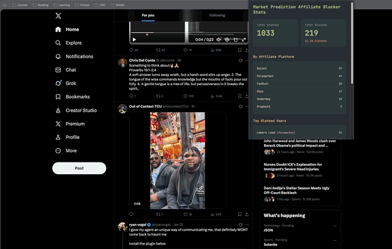

import PieChart from '../../src/components/Shared/d3/pieChart'

## The Rise of Speculative Wealth Traps

Before diving into this post, I want to clarify my specific beliefs regarding sports betting and prediction markets. In
a vacuum, I have no moral qualms with the principle of gambling. I’ve certainly laid down some sports bets while in Las
Vegas. That said, I do not play daily fantasy sports (DFS) or engage in any sort of online betting or prediction
markets. Mirroring many of my thoughts regarding social media, I personally feel that unfettered online access to the
dopamine hits of gambling is deeply unhealthy for the human psyche. In addition, I believe that the potential for sudden
personal wealth via highly speculative risks (much like cryptocurrencies) attracts so many willing participants due to
the rapidly vanishing middle class and the increasing scarcity of quality job opportunities. As the already massive
global wealth inequality continues to widen, I view these as yet another transfer of capital from the middle and lower
classes back to corporations and executives. As a diehard sports fan, I am also profoundly disappointed at how
intertwined sports media and betting have become. People today simply cannot watch any sports coverage without being
bombarded with online betting ads. In fact, I fear that new sports fans are now unable to distinguish between betting
and the sports themselves. Kids and teenagers today only know betting to be woven into the very fabric of sports.

Then came the prediction markets. Let’s start with the definition from Wikipedia:

> Prediction markets, also known as betting markets, information markets, decision markets, idea futures, or event
> derivatives, are open markets that enable the prediction of specific outcomes using financial incentives (gambling on
> real-world events). They are exchange-traded markets established for trading bets in the outcome of various events.

Think about why sports are so often the target of betting. It’s a controlled environment with clearly established rules.
Each player and coach has their own incentives to perform to the best of their ability, regardless of circumstances. The
leagues themselves have vested interests in ensuring that the games are refereed and scored fairly in order to maintain
public trust that these are competitions rather than scripted entertainment. Even with these guardrails and incentives,
there have been several cases recently of players engaging in game manipulation across the NCAA, NBA, and MLB. Now,
throw out virtually any guardrails. Add in the fact that folks can now bet on damn near anything.

On January 3rd, 2026, the United States illegally invaded Venezuela after committing various war crimes throughout the
region in the months prior. The target of Operation Absolute Resolve (other than Venezuela’s oil) was Nicolás Maduro,
the leader at the time. While this news sent shockwaves around the world, a story about prediction markets may have been
lost in the mix for some. Someone, almost certainly with inside information, created a Polymarket account in order to
bet on real-world events. Specifically, they bet on Maduro leaving office, which had odds of approximately 7% at the
time. The user pocketed over $436,000. Real-world insider trading with classified military intelligence.

## The Common Person Will Not Win

While this is by far the most public example, it shows just how rigged the system is. Polymarket and Kalshi, two of the
largest players in the predictive market space, are not who you are betting against. Rather than a traditional betting
model where the customer bets against the house, these two simply facilitate the bets and take a cut of each. As such,
they have no incentive to prevent insider trading unless it decreases trade volume (i.e., their revenue). In fact,
Shayne Coplan (Polymarket CEO) said the following in a 60 Minutes interview:

> I think that people going and having an edge to the market is a good thing. Obviously, you need to curate them, and
> you need to be clear and stringent on where the line is drawn...

Aside from this being virtually impossible to enforce, this clearly spells out the game. If you have insider information
about world events, you are almost certainly wealthy already. Generally speaking, the average person is not high enough
in their
company's org chart to obtain sufficient information to commit insider trading. This leaves two winners and one loser in
the predictive market game.
Prediction market companies derive revenue from trades with no risk to themselves. The insiders have a significantly higher chance
of winning than outsiders. This leaves the common person to foot the bill. Their money is then funneled to the elite and
corporations. Game over, sucker.

If you’re hoping for regulatory oversight, you will likely be disappointed. Donald Trump Jr. is a paid advisor for both
Polymarket and Kalshi. Ignoring the obvious conflicts of interest (as well as the other opportunities that the Trump
family has capitalized on to profit at least $1.4 billion from the presidency), the Republican administration has yet to
show any initiative in actually regulating these industries.

## The Impossibility of Avoiding Gambling in Modern Life

With all this context, you might think that one could just avoid sports betting and gambling markets altogether. Believe
me, I’ve tried. Even outside the digital realm, I walk past a giant Polymarket ad every single day as I walk around my
neighborhood in downtown Los Angeles.


While walking past this poster one day, I thought about all the Twitter accounts in my feed that had suddenly become
affiliates of Kalshi or Polymarket, noted by the respective company logo next to their username. I still haven't been
able to figure out exactly what being an affiliate means or what benefits prediction market companies offer to these
accounts. I even reached out to a few via DM for more information, but none responded. It’s no secret that I’m a Los
Angeles Lakers fan, so here’s an example of an account that I do not follow but often appears in my feed:


A simple idea came to mind. What if I could measure just how much of my feed are affiliates of gambling
companies? The experiment begins.

## The Plan and Implementation

- Since Elon Musk ruined Twitter, I’ve noticed that API call limits are much stricter
- I have no interest in paying money to Twitter, so capturing data client-side (i.e., via the web browser) made a lot of sense
- Blocking accounts would impact my algorithm
- However, simply hiding this type of content via CSS would allow me to observe how often it appears in my feed in a
  controlled way, without having to physically see the actual content
- I had never taken the time to build a Chrome extension, so it seemed like some fun JavaScript hacking

The first steps were to parse the HTML from Twitter and figure out a clever way to determine if an account is an
affiliate of one of the gambling companies. Surprisingly, this took a bit of research. One might think that there is
some obvious text indicating the affiliate company. The best way that I found was to parse the URL for the affiliate
image (i.e., the little picture with Kalshi or whichever gambling company). I noticed that each had a long string of
numbers that served as an ID for the parent account. After reviewing several of the most prominent affiliations, I built
a simple mapping.

```javascript title='content.js'
const BLOCKED_AFFILIATE_BADGE_IDS = {
  '2000660110239023106': 'Kalshi',
  '1994986527341113344': 'Polymarket',
  '2005664281002491904': 'Polymarket',
  '1961093049913851904': 'ProphetX',
  '1954932272378925056': 'FanDuel',
  '1996078471097761792': 'Onyx',
  '2007116898677243904': 'Underdog',
};
```

With this mapping, each tweet can be easily categorized by parsing the HTML using JavaScript.

```javascript title='content.js'
function processTweets() {
  const tweets = document.querySelectorAll('article[data-testid="tweet"]');
  tweets.forEach((tweet) => {
    const container = tweet.parentElement;
    if (!container) return;
    if (container.style.display === 'none') return;
    if (!tweet.dataset.scanned) {
      tweet.dataset.scanned = 'true';
      // function to count total Tweets scanned
      incrementScannedCount();
    }
    const affiliate = getAffiliateType(tweet);
    if (affiliate) {
      const userArea = tweet.querySelector('[data-testid="User-Name"]');
      const nameLink = userArea ? userArea.querySelector('a') : null;
      const username = nameLink ? nameLink.textContent : 'unknown';
      const tweetText = tweet.querySelector('[data-testid="tweetText"]');
      const body = tweetText ? tweetText.textContent.substring(0, 100) : 'no text';
      container.style.display = 'none';
      if (!tweet.dataset.blocked) {
        tweet.dataset.blocked = 'true';
        // track stats in local storage
        updateBlockedStats(username, affiliate);
      }
    }
  });
}
```

There’s a bit more code for the UI and storage logic, but you can find the complete
repository [here](https://github.com/scottenriquez/market-prediction-blocker-chrome-extension). I rarely write
JavaScript these days, so I’d hardly consider this my software magnum opus. There’s probably some edge cases remaining,
and I slapped this together over some coffee on a Saturday morning. Pull requests are welcome. Here's the extension in
action:



## The Results

As mentioned above, I intentionally do not follow any account that is an affiliate of Polymarket, Kalshi, or any
gambling company. Given the opacity of any recommendation algorithm, I can’t explain or reproduce exactly how or why
certain accounts appear in my feed. This was far from a perfect experiment, but the directional results were still
surprising. Below is the breakdown ($$n=1200$$):

<PieChart
data={[
{ category: 'Not', count: 896 },
{ category: 'Gambling Affiliate', count: 304 },
]}
labelName="category"
valueName="count"
/>

Of the affiliates, Kalshi and Polymarket had the lion's share of influence on my feed:

<PieChart
data={[
{ platform: 'Kalshi', count: 137 },
{ platform: 'Polymarket', count: 114 },
{ platform: 'FanDuel', count: 20 },
{ platform: 'Onyx', count: 14 },
{ platform: 'Underdog', count: 10 },
{ platform: 'ProphetX', count: 9 },
]}
labelName="platform"
valueName="count"
/>

Obviously, everyone’s feed is very different. Mine centers on sports and politics, which now seem more geared toward
gambling, unfortunately. With that said, the scale of this marketing campaign is staggering. One in four tweets that I
should have seen is written by these gambling affiliates. While it is certainly not the case that these accounts are
constantly spewing gambling ads, there seems to be something much larger at play as these companies continue to prey on
people through constant marketing, addiction, and hope of making money.

## Try It Yourself

As mentioned, this code is available under MIT
on [GitHub](https://github.com/scottenriquez/market-prediction-blocker-chrome-extension). At this time, I have no plans
to publish in the Chrome Web
Store due to my unfamiliarity with the rules and requirements. That said, it’s straightforward to install extensions
manually:

- Navigate to `chrome://extensions/`
- Enable developer mode
- Click the button to load the unpacked extension
- Select the directory where you cloned the GitHub repository (specifically where the `manifest.json` file resides)
- Go to Twitter
- Scroll through some content
- Open the extension to view the UI
