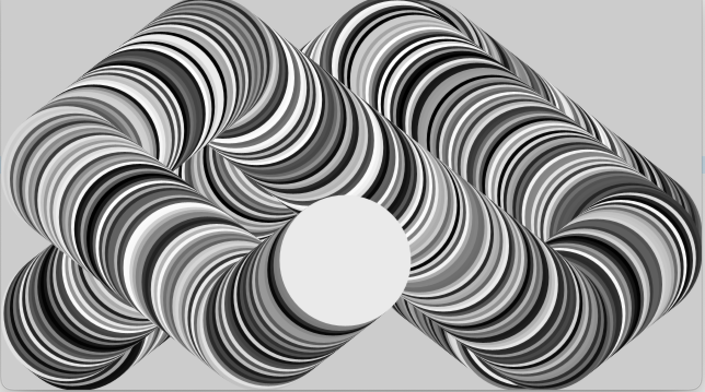

import BouncingSphere from '../../src/components/NatureOfCode/One/BouncingSphere/bouncingSphere';
import BouncingSphereWithAcceleration from '../../src/components/NatureOfCode/One/BouncingSphereWithAcceleration/bouncingSphereWithAcceleration';
import Vector from '../../src/components/NatureOfCode/One/Vectors/vector';

## About the Book
Recently, I started reading a fantastic book called *The Nature of Code* by Daniel Shiffman. From the [description](https://natureofcode.com/):
> How can we capture the unpredictable evolutionary and emergent properties of nature in software? How can understanding the mathematical principles behind our physical world help us to create digital worlds? This book focuses on a range of programming strategies and techniques behind computer simulations of natural systems, from elementary concepts in mathematics and physics to more advanced algorithms that enable sophisticated visual results. Readers will progress from building a basic physics engine to creating intelligent moving objects and complex systems, setting the foundation for further experiments in generative design.

Daniel implements numerous examples using a programming language called [Processing](https://processing.org). Instead, I decided to write my own versions using JavaScript, React, Three.js, and D3. For this blog series, I intend to implement my learnings from each chapter.

## Previous Entries in the Blog Series
- [Introduction](https://scottie.is/writing/nature-of-code-introduction-examples)

## Introduction to Euclidean Vectors
From [Wikipedia](https://en.wikipedia.org/wiki/Euclidean_vector):
> In mathematics, physics, and engineering, a Euclidean vector or simply a vector (sometimes called a geometric vector or spatial vector) is a geometric object that has magnitude (or length) and direction. Euclidean vectors can be added and scaled to form a vector space. A Euclidean vector is frequently represented by a directed line segment, or graphically as an arrow connecting an initial point `A` with a terminal point `B`.

The book references example code in the Processing programming language that simulates a bouncing ball in two-dimensional space. Below is the core logic:

```csharp title='Bounce.pde'
void draw()
{
  xpos = xpos + (xspeed * xdirection);
  ypos = ypos + (yspeed * ydirection);
  // width-rad and rad refer to the boundaries of the screen
  if (xpos > width-rad || xpos < rad) {
    // invert direction if an edge has been hit
    xdirection *= -1;
  }
  if (ypos > height-rad || ypos < rad) {
    // invert direction if an edge has been hit
    ydirection *= -1;
  }
  ellipseMode(RADIUS);
  fill(random(256));
  ellipse(xpos, ypos, rad, rad);
}
```
This image from the Processing code output shows the ball's movement through vector space. The circle's path is tracked by selecting a random color for the ball on each iteration:



To expand this example to the third dimension, additional variables called `zpos` and `zspeed` are required. Obviously, this approach does not scale well to `n` dimensions since each needs new speed and position variables. While vectors alone don't expand the physics functionality (e.g., the circle's motion), they streamline and minimize the amount of code required to include new dimensions. In JavaScript, we can write a simple class to organize the components and implement vector operations such as addition.

```javascript title='src/components/NatureOfCode/One/NVector/nVector.js'
class NVector {
  constructor(...components) {
    this.components = components;
  }

  get dimensions() {
    return this.components.length;
  }

  // assumes that the second vector has the same dimensions as the first
  add(otherVector) {
    return new NVector(
      ...this.components.map((component, index) => component + otherVector.components[index])
    );
  }
}
```

After instantiating two `NVector` objects, a third vector can be created to capture the sum. This vector addition is the basis for simulating motion:
```javascript
let circleLocation = new NVector(1, 2, 3);
const circleVelocity = new NVector(4, 5, 6);
circleLocation = circleLocation.add(circleVelocity);
// { components: [5, 7, 9] }
console.log(circleLocation);
```

In other words:
$$
\overrightarrow{location} = \overrightarrow{location} + \overrightarrow{velocity}
$$
Or:
$$
location_{x} = location_{x} + velocity_{x}
$$
$$
location_{y} = location_{y} + velocity_{y}
$$
$$
location_{z} = location_{z} + velocity_{z}
$$

Vector subtraction behaves the same way as addition:
```javascript title='src/components/NatureOfCode/One/NVector/nVector.js'
// assumes that the second vector has the same dimensions as the first
subtract(otherVector) {
  return new NVector(
    ...this.components.map((component, index) => component - otherVector.components[index])
  );
}
```

For multiplication, there are both scalar and vector products:
```javascript title='src/components/NatureOfCode/One/NVector/nVector.js'
scale(scalar) {
  return new NVector(...this.components.map(component => component * scalar));
}

// assumes that the second vector has the same dimensions as the first
dot(otherVector) {
  return this.components.reduce((sum, component, index) => sum + component * otherVector.components[index], 0);
}
```

Scalar multiplication can be written as (where `n` is a single number):
$$
\overrightarrow{w} = \overrightarrow{u} * n
$$
Or:
$$
w_{x} = u_{x} * n
$$
$$
w_{y} = u_{y} * n
$$
$$
w_{z} = u_{z} * n
$$

```javascript
const u = new NVector(1, 3, 5);
const n = 3
const w = u.scale(n);
// { components: [3, 9, 15] }
console.log(w);
```

For dot products (where `n` is the dimension of vector space):
$$
{\displaystyle \mathbf {u} \cdot \mathbf {v} =\sum _{i=1}^{n}u_{i}v_{i}=u_{1}v_{1}+u_{2}v_{2}+\cdots +u_{n}v_{n}}
$$

```javascript
const u = new NVector(1, 3, -5);
const v = new NVector(4, -2, -1);
const w = u.dot(v);
// 3
console.log(w);
```

Finally, a vector's magnitude (or length) can be calculated like so:
$$
{\displaystyle \|\mathbf {u} \|={\sqrt {u_{1}^{2}+u_{2}^{2}+\cdots +u_{n}^{2}}}.}
$$

This is useful for normalizing a vector (which we do in the bouncing sphere example later in the post):
$$
{\displaystyle \mathbf {\hat {u}} ={\frac {\mathbf {u}}{\|\mathbf {u} \|}}}
$$

With this code in hand (plus [a graphics library](https://threejs.org/)), we can start to model vectors in three-dimensional space:

```javascript
// additionally, a line is drawn between the two vectors
const vectors = [
  new THREE.Vector3(-10, -10, -10),
  new THREE.Vector3(10, 10, 10)
];
```

<Vector />

## Bouncing Sphere Using Vectors
Using our knowledge of vectors and a Vector class (`THREE.Vector3`, which is our graphics library's implementation of our `NVector`), we can expand the bouncing ball Processing example into the third dimension. First, create a sphere with a random starting position vector within the bounds of our space (i.e., -50 to 50).

```javascript title='src/components/NatureOfCode/One/BouncingSphere/boucingSphere.js'
const generateSphere = () => {
  const x = Math.random() * 100 - 50;
  const y = Math.random() * 100 - 50;
  const z = Math.random() * 100 - 50;
  const sphereLocationVector = new THREE.Vector3(x, y, z);
  const sphereGeometry = new THREE.SphereGeometry(5, 32, 32);
  const sphereMaterial = new THREE.MeshStandardMaterial({color: 0x50fa7b, roughness: 0});
  const sphere = new THREE.Mesh(sphereGeometry, sphereMaterial);
  sphere.position.set(sphereLocationVector.x, sphereLocationVector.y, sphereLocationVector.z);
  return sphere;
};
```

Similarly to the two-dimensional example, the `animate` function uses the screen's boundaries as a signal to invert the direction of the sphere by negating the corresponding component in the velocity vector:

```javascript title='src/components/NatureOfCode/One/BouncingSphere/sceneInit.js'
generateVelocityVector() {
  const x = (this.isXPositiveDirection ? 1 : -1) * 15;
  const y = (this.isYPositiveDirection ? 1 : -1) * 15;
  const z = (this.isZPositiveDirection ? 1 : -1) * 15;
  return new THREE.Vector3(x, y, z);
}

animate() {
  const sphere = this.scene.getObjectByName('sphere');
  window.requestAnimationFrame(this.animate.bind(this));
  if (sphere.position.x > this.topXPosition || sphere.position.x < this.bottomXPosition) {
    this.isXPositiveDirection = !this.isXPositiveDirection;
  }
  if (sphere.position.y > this.topYPosition || sphere.position.y < this.bottomYPosition) {
    this.isYPositiveDirection = !this.isYPositiveDirection;
  }
  if (sphere.position.z > this.topZPosition || sphere.position.z < this.bottomZPosition) {
    this.isZPositiveDirection = !this.isZPositiveDirection;
  }
  const timeDelta = this.clock.getDelta();
  const sphereVelocityVector = this.generateVelocityVector();
  sphereVelocityVector.addScalar(timeDelta);
  sphereVelocityVector.normalize();
  sphere.position.add(sphereVelocityVector);
  this.render();
  this.controls.update();
}
```

Leveraging the [clock's time delta](https://threejs.org/docs/#api/en/core/Clock) (i.e., the time elapsed since the last frame) for scalar addition and normalizing the sphere velocity vector simulates motion over time in our three-dimensional space.

<BouncingSphere />

## Bouncing Sphere with Random Acceleration

In the first bouncing sphere model, the initial position is random. However, the path that the sphere takes is a deterministic loop. Next, we add random acceleration to the velocity, which alters the predictability of the path. In other words, the final algorithm is:

$$
\overrightarrow{finalVelocity} = \overrightarrow{initialVelocity} + \overrightarrow{acceleration} + time
$$
With the final velocity as $${\mathbf {v}}$$:
$$
{\displaystyle \mathbf {\hat {v}} ={\frac {\mathbf {v}}{\|\mathbf {v} \|}}}
$$
With the normalized vector as $${\mathbf {\hat {v}}}$$:
$$
{\overrightarrow{location} = \overrightarrow{location} + \displaystyle \mathbf {\hat {v}}}
$$

Implemented in JavaScript, this is:
```javascript title='src/components/NatureOfCode/One/BouncingSphereWithAcceleration/sceneInit.js'
generateVelocityVector() {
  const x = (this.isXPositiveDirection ? 1 : -1) * 15;
  const y = (this.isYPositiveDirection ? 1 : -1) * 15;
  const z = (this.isZPositiveDirection ? 1 : -1) * 15;
  return new THREE.Vector3(x, y, z);
}

generateRandomAccelerationVector() {
  const x = Math.random() * 30 - 15;
  const y = Math.random() * 30 - 15;
  const z = Math.random() * 30 - 15;
  return new THREE.Vector3(x, y, z);
}

animate() {
  const sphere = this.scene.getObjectByName('sphere-acceleration');
  window.requestAnimationFrame(this.animate.bind(this));
  if (sphere.position.x > this.topXPosition || sphere.position.x < this.bottomXPosition) {
    this.isXPositiveDirection = !this.isXPositiveDirection;
  }
  if (sphere.position.y > this.topYPosition || sphere.position.y < this.bottomYPosition) {
    this.isYPositiveDirection = !this.isYPositiveDirection;
  }
  if (sphere.position.z > this.topZPosition || sphere.position.z < this.bottomZPosition) {
    this.isZPositiveDirection = !this.isZPositiveDirection;
  }
  const timeDelta = this.clock.getDelta();
  const sphereVelocityVector = this.generateVelocityVector();
  const sphereAccelerationVector = this.generateRandomAccelerationVector();
  sphereVelocityVector.addScalar(timeDelta);
  sphereVelocityVector.add(sphereAccelerationVector);
  sphereVelocityVector.normalize();
  sphere.position.add(sphereVelocityVector);
  this.render();
  this.controls.update();
}
```

<BouncingSphereWithAcceleration />
